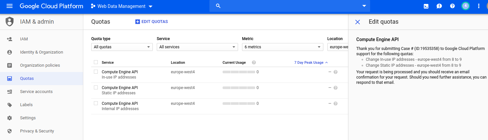

# Locust.io
This folder contains everything regarding testing our microservices with [locust.io](https://locust.io/).

## Requirements for local installation
Python 3

## Installation
`pip install locustio`

## Running Single Locust in localhost
`cd helm/tasks/`  
Change the endpoint addresses in tasks.py and run  
`locust -f tasks.py --host=""`     
Open browser for locustio UI  
`localhost:8089`

## Understanding Distributed Locust
Locust can be run in a distributed way on multiple machines. Firstly a master must be run.
After that a slave can be run in another machine. If run locally, all slaves default to 127.0.0.1
and no master host must be specified.  
Running master:  
`locust -f tasks.py --host="" --master`  
Running slave:  
`locust -f tasks.py --slave --master-host=<master-url>`  

## Running Distributed Locust with Helm (Kubernetes + Docker) in Google Cloud  
First, create a google cloud project:
* https://console.cloud.google.com/cloud-resource-manager  
### Google Cloud Console Quickstart
Get gcloud and kubectl installed
* https://cloud.google.com/kubernetes-engine/docs/quickstart  
Also run:  
`gcloud config set project [PROJECT_ID]`

After that you need to change quotas in Google Cloud Console:   
* CPUS_ALL_REGIONS = 576
* Regional (us-east1) CPUs = 576
* Regional (us-east1) In-use IP addresses = 9
  
After this you can deploy a cluster  
* `gcloud beta container clusters create --machine-type n1-highcpu-64 locust-cluster --zone us-east1 --preemptible`  
You should end up something like:
```
NAME            LOCATION      MASTER_VERSION  MASTER_IP      MACHINE_TYPE   NODE_VERSION   NUM_NODES  STATUS
locust-cluster  europe-west4  1.12.7-gke.10   34.90.190.240  n1-highcpu-64  1.12.7-gke.10  9          RUNNING
```  
MAKE SURE TO DELETE THE CLUSTER ONCE YOU HAVE FINISHED TESTING, this cluster costs $0.4800 per hour!  
### Helm Deployment
If first time, init helm in Kubernetes cluster to install Tiller  
`helm init --history-max 200`  
Follow commands from this post:  
* https://github.com/helm/helm/issues/3130#issuecomment-372931407  
After that:  
* Change locust slave count (`replicaCount`) and `target-host` in `helm/values.yaml`  
* Change locustfile under `helm/tasks/tasks.py`  
`cd helm`  
`helm install --name helm-locust -f values.yaml ./`  
Find the master pod and forward it  
`kubectl get pods`  
`kubectl port-forward <master-pod-name> 8089`    
Access external swarm via local url:  
[http://127.0.0.1:8089/](http://127.0.0.1:8089/)

## Removing 
`helm del --purge helm-locust`  
`gcloud container clusters delete locust-cluster`

## Debug kubectl pods
* `kubectl get pods`
* `kubectl describe pods ${pod-name}`
* `kubectl -n default logs -p ${pod-name}`

## Additional Documentation on The Chart  
* https://github.com/helm/charts/tree/master/stable/locust